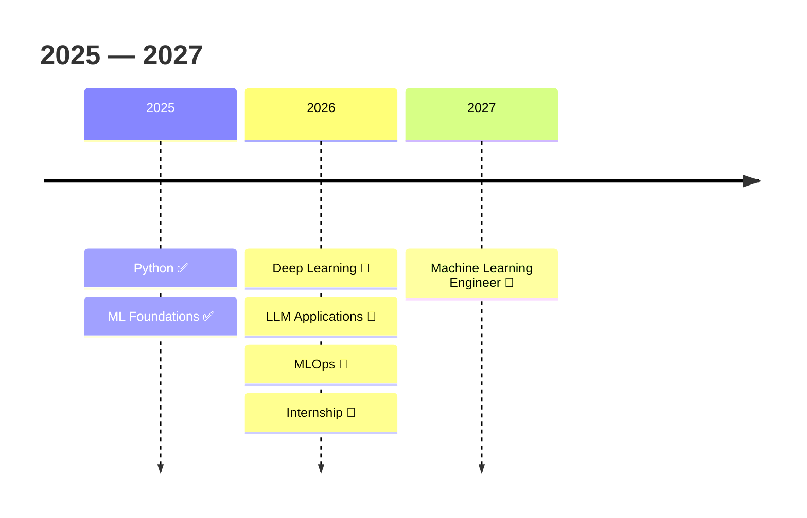

<div align="center">


<br/>


<br/><br/>

<a href="#"></a>
<a href="#"></a>
<a href="#"></a>
<a href="#"></a>

</div>

<br/>

<div align="center">

### B.E. Computer Science & Engineering (AI & ML) · KGiSL Institute of Technology · India

</div>

<br/>

<table width="100%">
<tr><td>

```
$ whoami

Name        : Aarthi Suresh
Role        : AIML Student & Software Developer
College     : KGiSL Institute of Technology
Focus       : Machine Learning
Building    : AI Products
Learning    : Deep Learning & MLOps
Goal        : Machine Learning Engineer

Status      : Currently Building...
```

</td></tr>
</table>

<br/>

## About

```python
class Aarthi:
    def __init__(self):
        self.role          = "AIML Student & Software Developer"
        self.education      = "B.E. CSE (AI & ML), KGiSL Institute of Technology"
        self.goal            = "Machine Learning Engineer"

        self.interests        = [
            "Machine Learning", "Deep Learning", "NLP",
            "Computer Vision", "Data Science",
            "Backend Development", "Open Source", "MLOps",
        ]

        self.currently_learning = [
            "Transformers", "LLM Applications",
            "MLOps", "System Design", "Backend Architecture",
        ]

    def philosophy(self) -> str:
        return (
            "The fastest way to learn is by building — "
            "not by watching another tutorial."
        )

aarthi = Aarthi()
```

<br/>

## Featured Work

<table width="100%">
<tr>
<td width="50%" valign="top">
<h3>🧩 AeroPuzzle</h3>
<p>A gesture-controlled puzzle game built with computer vision — every interaction is a hand gesture, no keyboard or mouse required.</p>
<p>


</p>

<br/><br/>
<b><a href="#">View Repository →</a></b> &nbsp;·&nbsp; <a href="#">Live Demo</a>
</td>
<td width="50%" valign="top">
<h3>📜 ClausePilot</h3>
<p>An AI-powered legal contract analyzer that uses NLP to classify risky clauses, helping users understand contracts faster.</p>
<p>


</p>

<br/><br/>
<b><a href="#">View Repository →</a></b> &nbsp;·&nbsp; <a href="#">Live Demo</a>
</td>
</tr>
<tr>
<td width="50%" valign="top">
<h3>🎓 EduGuard</h3>
<p>A student performance prediction system that flags academic risk early and surfaces insights for timely intervention.</p>
<p>


</p>

<br/><br/>
<b><a href="#">View Repository →</a></b> &nbsp;·&nbsp; <a href="#">Live Demo</a>
</td>
<td width="50%" valign="top">
<h3>📊 PlacePulse</h3>
<p>A placement prediction and analysis platform that forecasts outcomes from academic and skill-based features.</p>
<p>


</p>

<br/><br/>
<b><a href="#">View Repository →</a></b> &nbsp;·&nbsp; <a href="#">Live Demo</a>
</td>
</tr>
</table>

<br/>

## Skills

<table width="100%">
<tr>
<td valign="top" width="33%">

**Languages**
<br/>


**Machine Learning**
<br/>


</td>
<td valign="top" width="33%">

**Backend**
<br/>


**Data Science**
<br/>


</td>
<td valign="top" width="33%">

**Tools & Cloud**
<br/>


**Version Control & Dev Environment**
<br/>


</td>
</tr>
</table>

<br/>

## Now Building

<table width="100%">
<tr><td>

- 🤖 &nbsp;**AI Resume Analyzer** — NLP-driven resume scoring and feedback tool
- 💬 &nbsp;**Intelligent Chatbot** — context-aware conversational agent
- 📦 &nbsp;**Python Package** — first open-source utility library, in progress
- 🧪 &nbsp;**ML Portfolio Projects** — applied deep learning experiments
- 🌐 &nbsp;**Open Source Contributions** — first external PRs in progress

</td></tr>
</table>

<br/>

## Proof of Work

<table width="100%">
<tr>
<td align="center" width="16%"><h2>12+</h2>Projects Built</td>
<td align="center" width="16%"><h2>150+</h2>LeetCode Solved</td>
<td align="center" width="16%"><h2>0</h2>PyPI Packages</td>
<td align="center" width="16%"><h2>2</h2>OSS Contributions</td>
<td align="center" width="16%"><h2>3</h2>Kaggle Competitions</td>
<td align="center" width="16%"><h2>4</h2>Technical Blogs</td>
</tr>
</table>

<div align="center"><sub>Numbers are placeholders — swap in your real counts before publishing.</sub></div>

<br/>

## GitHub Philosophy

<table width="100%">
<tr><td>

GitHub isn't just where I upload finished projects — it's my public engineering journal. Every experiment, bug fix, failed idea, and refactor gets committed, because development is iterative by nature. I'd rather show the journey than only the destination.

</td></tr>
</table>

<br/>

## Analytics

<div align="center">


<br/>


<br/><br/>


<br/><br/>


</div>

<details>
<summary><b>Trophy Case</b></summary>
<br/>
<div align="center">


</div>
</details>

<br/>

## Roadmap



<br/>

---

<div align="center">

**Still learning. Still building. Still shipping.**

</div>
