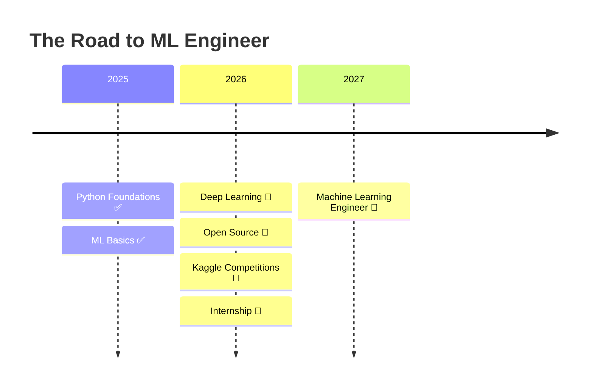

<div align="center">


<br/>


<br/>

> *Building products instead of collecting tutorials.*

<br/>

<a href="#"></a>
<a href="#"></a>
<a href="#"></a>
<a href="#"></a>

</div>

<br/>

## `$ whoami`

<div align="center">

```powershell
PS C:\Users\Aarthi> whoami --verbose

────────────────────────────────────────────
  Name        : Aarthi Suresh
  Role        : AI/ML Student & Builder
  Stack       : Python · ML · Backend APIs
  Building    : Production-grade AI systems
  Mindset     : Ship > Tutorial
  Status      : ● Currently Coding...
────────────────────────────────────────────
```

</div>

<br/>

## `class Aarthi:`

```python
class Aarthi:

    def __init__(self):
        self.education      = "B.E. CSE (AI & ML)"
        self.location        = "India"
        self.interests        = [
            "Machine Learning",
            "Natural Language Processing",
            "Computer Vision",
            "Backend APIs",
            "Open Source",
        ]
        self.motto            = "Learn by Building"
        self.current_focus    = "Production-grade AI systems"
        self.long_term_goal    = "Machine Learning Engineer"

    def philosophy(self) -> str:
        return "I'd rather ship a rough prototype than perfect a tutorial."

aarthi = Aarthi()
print(aarthi.philosophy())
```

```
>>> I'd rather ship a rough prototype than perfect a tutorial.
```

<br/>

## `> mission_status --dashboard`

<div align="center">

| Mission | Progress |
|:---|:---:|
| 🎯 Become ML Engineer |  |
| 🌱 Open Source Contributions |  |
| 🧠 Deep Learning Mastery |  |
| 💼 Internship Ready |  |
| 📦 PyPI Packages Shipped |  |

</div>

<br/>

## Featured Builds

<table width="100%">
<tr>
<td width="50%" valign="top">

### 🧩 AeroPuzzle
Gesture-controlled puzzle game powered by real-time computer vision — solve puzzles using nothing but hand motion.

`Python` `OpenCV` `MediaPipe`


&nbsp;**[→ View Repo](#)**

</td>
<td width="50%" valign="top">

### 📜 ClausePilot
An AI-powered contract analyzer that flags risky clauses in legal documents before you sign on the dotted line.

`Python` `NLP` `FastAPI` `LLMs`


&nbsp;**[→ View Repo](#)**

</td>
</tr>
<tr>
<td width="50%" valign="top">

### 🎓 EduGuard
A predictive system that flags at-risk student performance early, so intervention happens before it's too late.

`Python` `Scikit-learn` `Pandas`


&nbsp;**[→ View Repo](#)**

</td>
<td width="50%" valign="top">

### 📊 PlacePulse
A data-driven platform that predicts campus placement outcomes using historical academic and skill-based trends.

`Python` `Flask` `ML` `Data Viz`


&nbsp;**[→ View Repo](#)**

</td>
</tr>
</table>

<br/>

## Tech Arsenal

<div align="center">

**Languages**


**Machine Learning & Data Science**


**Backend & Frameworks**


**Tools & Cloud**


</div>

<br/>

## Why I Use GitHub

<div align="center">

<table width="90%">
<tr><td>

For me, this profile isn't a project graveyard — it's a learning journal that happens to be public. Every commit is a snapshot of what I understood on that day, and every messy early version of a project stays up on purpose. I'd rather show the climb than just the summit. If a repo looks rough, it's probably the one that taught me the most.

</td></tr>
</table>

</div>

<br/>

## Roadmap



<br/>

## Fun Facts

<div align="center">

| | |
|:---|:---|
| ☕ | Powered by coffee, not by sleep |
| 🐛 | Professional bug creator, occasional bug fixer |
| 🤖 | Talks to AI more than humans on an average day |
| 🚀 | Would rather ship something broken than watch another tutorial |
| 📚 | Reads documentation recreationally |

</div>

<br/>

## GitHub Analytics

<div align="center">


<br/>


<br/><br/>


<br/><br/>


</div>

<details>
<summary><b>🏆 Trophy Case (click to expand)</b></summary>
<br/>
<div align="center">


</div>
</details>

<br/>

---

<div align="center">

### ⭐ Thanks for stopping by

If something here sparked an idea or solved a problem for you, a star on the repo means more than you'd think.

<br/>

**Happy Coding 🚀**

<br/>


</div>
